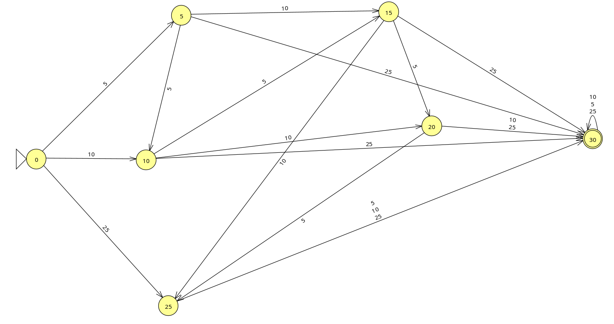

# Vending Machine — Autômato Finito

Simulação de uma máquina de bebidas que aceita moedas de 5¢, 10¢ e 25¢. O produto custa 30¢.

## Autômato

O diagrama em `automato.png` representa os estados possíveis da máquina: `q0`, `q5`, `q10`, `q15`, `q20` e `q25`. Cada estado indica o crédito acumulado antes de chegar ao valor do produto.

O estado inicial é `q0`. A cada moeda inserida, o autômato segue para o estado correspondente ao novo valor acumulado. Quando a soma chega a **30¢ ou mais**, a máquina alcança a condição de aceitação e libera o produto.

## Implementação

A interface foi feita com HTML, CSS e JavaScript puro. Os botões inserem as moedas e o JavaScript atualiza o visor, o estado destacado no mapa e o histórico de transições.

No `script.js`, a lógica principal usa condicionais (`if`/`else`) para verificar se a soma das moedas ainda é menor que 30¢ ou se já atingiu o valor necessário para liberar o produto.

## Visualização online

O projeto pode ser acessado pelo GitHub Pages:

[Abrir a simulação](https://samuelcstp.github.io/vendingMachine/)
